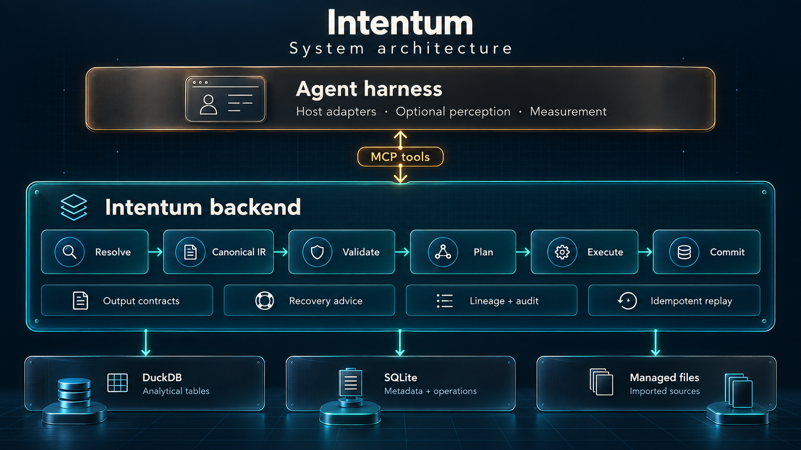
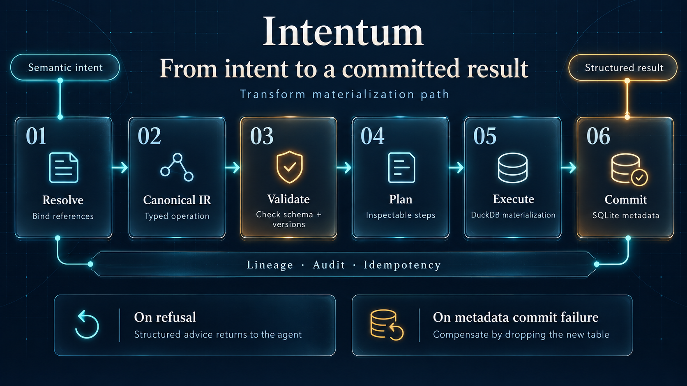

# Intentum

Sealed outcomes in this repository are recorded with
[Inkan](https://github.com/rowan-hiro/inkan).


**An intent runtime for AI agents.** Agents declare intent. Intentum compiles
it, checks it, executes it once, and keeps the record.

> Agent expresses intent. Intentum owns correctness.

An agent is probabilistic; the systems it acts on are not. Intentum is the
layer between the two. The agent never touches SQL, files, identifiers or
storage: it sends a loose intent through a small set of MCP tools, and the
runtime resolves it into a canonical operation, validates it, plans it,
executes it deterministically, commits it atomically and returns a structured
result. What comes back is not only the result but the record: how every
fuzzy reference was resolved, what was executed, and what the agent had
declared it was going to deliver.

This component was first called an agent-ready backend, and the Python
package is still `agent_backend`; the text below says "the backend" wherever
the runtime's process stands opposite the agent harness. The category name
changed because a backend waits to be called, and this one refuses, teaches,
holds the agent to its word and undoes its own work. Inkan, which this
repository uses for its own work, rests on the same idea one level up: what
the work is meant to deliver is written down before it starts, and what was
delivered is declared against it at the end. Intentum is that idea at the
tool-call boundary.

## What a database behind an MCP server does not do

Put DuckDB behind an MCP server and an agent can run SQL. Intentum is built
so that four things hold that a SQL tool cannot give.

### A closed language, taught on refusal

The tools expose no SQL and no file or table primitives. A transform is
written in a small step vocabulary (`select`, `filter`, `aggregate`, `sort`,
`limit`, `rename`, `derive`, `join`, `semi_join`), with one read-only
`raw_query` step as the long-tail fallback, sandboxed, version-bound and
recorded like any other step (MADR 0002). What an agent may write is an open
set; what the runtime accepts is small and closed. So every refusal is mapped
onto the nearest accepted shape and answered with three things: what was
read, what is accepted at that point, and, when the mapping is mechanical,
the agent's own request rewritten as the tool calls to send as-is
(MADR 0010). Two silent failures on *successful* responses get the same
treatment: an empty result whose filter literal occurs nowhere in the
filtered column, and a result that already fits the declared deliverable.
Convergence is measured rather than assumed: the harness reports refusals
without advice and the repair rate beside the pass rate.

### The deliverable is declared before the work, and the export is held to it

`declare_output` records the shape of the answer while the requirement is in
front of the agent: the columns the file carries, the row cardinality, and
what it is organized by (MADR 0007, 0012). `export_result` checks the dataset
against that contract before anything is read or written, refuses a mismatch
with the declared and the actual shape and the transform that repairs it, and
records a match with its evidence. The declaration is made at turn one; the
export is attempted twenty turns later; the check runs outside the agent's
context.

### Fresh output is trusted; recalled output is checked

The runtime never sees the task, so it cannot judge the agent's first reading
of anything. It can judge consistency, because it keeps the record. The
agent's fresh output, produced while the subject is in front of it, is
accepted as given. Anything the agent re-enters from earlier turns, a shape, a
value, a request, is verified against the runtime's own records before it
takes effect: an export against the declared contract, a replayed request
against its recorded fingerprint, a re-declaration against the open one. A
change the runtime cannot verify, such as an amended contract, needs a stated
reason and is recorded with the shape before and after (MADR 0008). The
design rule that follows: the agent's context is not a store. Anything that
must survive turns lives in the runtime and is used by reference, a dataset,
a version, a contract, an operation.

### Every operation is an intent record

An operation row is written `pending` before any work, updated with the
canonical IR and the plan before execution, and finalized in the same
transaction as the dataset, its columns, its version, its lineage edges and
its audit event. A replay of the same request returns the recorded response;
a failure after execution drops the physical table (MADR 0001). Provenance
reads back as the intent that was sent, the IR it became and the plan that
ran, so a reviewer reads what the agent meant rather than the SQL it would
have written.

## What it does not do

What the runtime owns is consistency, not the truth of the task. It never
sees the question the agent is answering, so it takes the agent's reading of
the requirement, and what it just computed, as given, and holds the agent to
everything it later reproduces from memory. A wrong first reading is enforced
as faithfully as a right one. The failure this exists to catch is *knew but
did not do*; *did not know* belongs to the model and the agent framework
(MADR 0004, 0007, 0008).

## The hypothesis and what the measurements say

Research hypothesis under test: a general-purpose agent interacts with a
structured data system more reliably through a small semantic intent
interface plus a deterministic runtime than by manipulating SQL, JSON,
Markdown, metadata files and storage primitives directly.

The recorded DataSpace rounds, dated and with their model and gateway
settings in the
[DataSpace README](agent_harness/scenarios/dataspace/README.md), say this
much so far: the language is used equally well by every model measured,
refusals are advised and taken, and the failure that remains is a reading
made in the declaration step, at every price. Those results apply to the
recorded runs, not to every model or every task. The controlled comparison
with and without the runtime on the same host is the experiment that would
attribute the passes to the runtime rather than to the model, and it has not
been run.

## Data is the first domain

The pipeline, the output contract, the trust model, teach-on-refusal,
idempotency, lineage, audit and compensation are not ideas about data; their
implementations here are shaped by the first domain. What is about data is
the step vocabulary, the expression language, the import formats and DuckDB.
Benchmarks such as DataSpace validate the runtime and do not define it
(MADR 0004); the same record sets the test for what comes next: a second
scenario, in another domain with another agent, needs no core changes.
Section 7 names the candidate.

## 1. Architecture



The successful materialized-transform path follows six stages:



<details>
<summary>Text pipeline and implementation details</summary>

```
loose intent (MCP tool call)
   │  {"source": "yesterday's sales", "transform": {"group_by": ["region"], "metric": "revenue"}}
   ▼
Resolve      core/resolver     fuzzy dataset/field/expression references → concrete ids and types
   │                           (records every lenient decision; refuses to guess on material ambiguity)
   ▼
Canonical IR core/ir           strict, typed, extra="forbid" pydantic models; every field carries its type
   │
Validate     core/validation   re-derives every type and schema with the shared type rules;
   │                           rejects stale versions, deleted inputs, tampered IR
   ▼
Plan         core/planner      explicit, inspectable step list: Scan → HashAggregate → Materialize → RegisterLineage → Audit
   │
Execute      core/execution    canonical IR → DuckDB (compiled semantic steps or sandboxed raw_query); materialize or preview
   │
Commit       core/backend      one SQLite transaction: dataset + columns + version + lineage + audit + operation + idempotency key
   │                           failure after execution ⇒ physical table dropped (compensation)
   ▼
structured response            success | needs_resolution | error{code, message, hint, candidates, recoverable}
```

</details>

Key properties, all enforced in software rather than in prompts:

| Concern | Where it lives |
|---|---|
| Identifiers, physical table names, storage paths, timestamps | allocated by the backend (`ds_N`, `col_N`, `art_N`, `op_N`, `ds_N_v1`), never accepted from the agent |
| Name normalization / uniqueness | Unicode-aware `slugify` (`公募基金经理(新)` → `公募基金经理_新`, `Regional Sales` → `regional_sales`) + partial unique index on active dataset names; original names stay reachable as aliases |
| Source provenance | every imported dataset points at an `Artifact` (file + content hash + optional managed copy) and a locator (SQLite table); documents and media are artifacts too |
| Semantic layer | `attach_metadata` ingests a `knowledge.md`-style document into dataset/column descriptions and units, reporting every fact that did not match |
| Schema and type correctness | shared type rules in `core/ir/typing.py`, applied twice (resolver inference, validator re-check) |
| Semantic types at import | text columns whose non-null values are all ISO dates/timestamps become `date`/`timestamp` (a source driver reports what it can store, not what the data means); an explicit `type` hint wins, and the refinement is a resolution note and part of the recorded IR |
| Value rendering | a property of the exported file, not of the data: `export_result` takes a validated `format_spec`; transforms compute, they do not format |
| Long-tail query shapes | a `raw_query` step (MADR 0002): one read-only SELECT over placeholder-bound inputs, checked with DuckDB's parser, `DESCRIBE`d before it runs, executed in a sandbox with no external access, and recorded like any other step |
| Ambiguity | `AmbiguousReferenceError` → `status: needs_resolution` with candidates |
| Write-ahead operation record | operation row is inserted `pending` before any work, updated with IR and plan before execution, and finalized in the commit transaction |
| Atomicity | DuckDB `CREATE TABLE AS` is atomic; metadata commit is one SQLite transaction; failure between the two drops the table |
| Idempotency | key = explicit `idempotency_key` or `sha256(canonical IR)`; replay returns the original response, key reuse with a different request is a `CONFLICT` |
| Lineage / provenance | `lineage_edges` per input dataset + operation record holding original intent, canonical IR and plan |
| Audit | `audit_events` for every state change, including failed operations |
| Access control | `AccessPolicy.check(principal, action, resource)` hook, consulted before every operation |
| Observability | structured log events per stage: `intent.received`, `resolution.completed`, `ir.canonical`, `validation.completed`, `plan.created`, `execution.completed`, `state.committed`, `operation.failed` |
| Storage abstraction | `MetadataStore` and `AnalyticsEngine` protocols; SQLite and DuckDB are implementations |

### Loose intent vs canonical IR

Input the agent sends:

```json
{"source": "the orders I imported today",
 "transform": {"group_by": ["region"], "metric": "revenue"},
 "name": "regional_sales"}
```

What is executed (abridged, obtainable with `explain: true`):

```json
{"operation": "transform",
 "source": {"dataset_id": "ds_1", "version": 1, "name": "orders"},
 "steps": [{"type": "aggregate",
            "group_by": [{"name": "region", "logical_type": "string", "column_id": "col_3"}],
            "measures": [{"function": "sum",
                          "field": {"name": "amount", "logical_type": "float", "column_id": "col_8"},
                          "alias": "revenue", "logical_type": "float"}],
            "output_schema": [...]}],
 "output": {"mode": "materialized", "name": "regional_sales"}}
```

The response tells the agent how each fuzzy reference was resolved:

```json
"resolution": [
  {"field": "source", "reference": "the orders I imported today",
   "resolved_to": "orders (ds_1)", "reason": "name/alias contains 'orders'; created today; was imported"},
  {"field": "transform.steps[0] (aggregate).measures[0]", "reference": "revenue",
   "resolved_to": "amount", "reason": "synonym of 'amount'"}]
```

### Resolution rules (in order)

Datasets: exact id → exact name → alias (an alias shared by several datasets is
reported as ambiguous, never picked) → normalized name → token scoring over
name/aliases/description/columns with temporal words (`today`/`今天`,
`yesterday`/`昨天`), origin words (`imported`/`导入`, `result`/`结果`), status
words (`published`/`发布`), and recency words (`latest`/`最新`, `earlier`/`之前`)
→ single clear winner, or a recency tie-break when the reference asks for it,
otherwise `needs_resolution`. Tokens are Unicode-aware: CJK runs contribute
character bigrams, so `股本变动` matches `北京股本变动`. A reference that hits a
deleted dataset returns `NOT_FOUND` with `restorable: true`.

Fields (resolved against the schema that is current at each step, so you can
sort by an aggregate alias): exact → case-insensitive/alias → normalized → small
built-in synonym groups (only if exactly one field matches) → fuzzy match (only
if exactly one) → `NOT_FOUND` with the list of available fields.

### Transform language

`transform` is one step object, a list of steps, or a compact object whose keys
are applied in the default order join → semi_join → filter → derive → select →
aggregate → sort → limit → rename. If that compact object's `select` names a
measure produced by its aggregate, the projection moves after the aggregate;
if its `sort` names a field the projection would drop, the projection moves
after the sort (a sort by a select alias keeps the projection first); an
explicit list of steps always keeps the written order:

```json
{"filter": "quantity >= 5 and region in ('West','East')",
 "group_by": ["region"],
 "measures": [{"function": "sum", "field": "amount", "alias": "revenue"}, {"count": "*", "as": "orders"}],
 "sort": "-revenue",
 "limit": 10}
```

Step types: `select`, `filter`, `aggregate`, `sort`, `limit`, `rename`,
`derive`, `join`, `semi_join`, and [`raw_query`](#raw-query-fallback), the
implemented SQL fallback.
A step may also be written without `type` when its key names
it, so `[{"filter": "amount > 100"}, {"sort": "-amount"}, {"limit": 3}]` is a
pipeline and `{"aggregate": {"group_by": [...], "measures": [...]}}` is an
aggregate step with its body nested under its own key; `select` and `derive`
accept SQL-style aliasing (`"end_date as report_period"`,
`"quantity * unit_price as line_total"`), `derive` accepts several
`{name, expression}` pairs at once, and `group_by` accepts a named expression
(`"date_trunc('day', observation_time) as day"`), which is derived ahead of
the aggregate. An aggregate with `group_by` and no measures returns the
distinct groups; an aggregate with neither is invalid.

`semi_join` keeps a left row when the referenced right dataset has at least
one row whose key or keys match, without copying right columns or multiplying
the left row when the right key is duplicated:

```json
{"type": "semi_join", "right": "allowed_customers",
 "on": {"customer_id": "customer_id"}}
```

The right dataset and version remain explicit in the canonical IR, plan and
lineage. When matches need a condition on the right side, filter and
materialize that dataset first, then reference the managed result here.

Expressions may be strings (`"quantity * unit_price"`,
`"amount > 100 and region in ['West', 'East']"`) or object trees; identifiers
are always resolved against the current schema and functions come from an
allowlist (`abs round floor ceil upper lower trim length substr substring left
right concat coalesce year month day date date_trunc date_diff strftime is_null contains
starts_with ends_with`; `||` is read as `concat`). `cast(x as type)` converts to
`integer`, `float`, `string`, `boolean`, `date` or `timestamp`, and accepts SQL
names such as `int`, `bigint`, `double`, `varchar`, `text`, `bool` and
`datetime`; a value that does not convert fails the transform. `x::type` is the
same cast, and `try_cast(x as type)` yields null for a value that does not
convert (DuckDB `TRY_CAST`). A two-argument call written
the other way round (`strftime('%Y-%m-%d', ts)`) is reordered to its signature
and reported as a resolution note; a type error names the signature it
expected. There is no SQL passthrough in expressions; SQL enters only as a
`raw_query` step.

### Raw query fallback

`raw_query` is implemented as a step in `transform_dataset` and
`materialize_result`. It handles shapes the other steps cannot express: a
window over groups (the latest order per customer), every row tied at an
extremum, a union of same-shaped datasets (MADR 0002). The semantic steps stay
the primary language. Every response that used a `raw_query` carries
`used_raw_query: true` (so do `explain`, `get_operation` and the producing
operation in `get_provenance`), so how often the vocabulary fell short, and on
which shapes, can be counted and the recurring shapes promoted to steps:

```json
[{"raw_query": {"sql": "SELECT o.customer, o.order_id, c.segment FROM input o JOIN customers c ON o.customer = c.name QUALIFY row_number() OVER (PARTITION BY o.customer ORDER BY o.order_date DESC, o.order_id DESC) = 1",
                "inputs": {"customers": "customers"}}},
 {"sort": "customer"}]
```

`sql` is one read-only DuckDB `SELECT` or `WITH` statement (set operations,
CTEs, window functions, `QUALIFY`, subqueries, `CASE`, `LIKE` and regular
expressions included) that reads datasets only by placeholder. `input` is the
transform's `source`; every other name is declared under `inputs` with a
dataset reference, resolved like any other (loose descriptions,
`needs_resolution` on ambiguity) and bound to that dataset's current version.
A placeholder is a plain table name in a namespace the backend controls, not
text it substitutes: DuckDB's parser finds the table references and the
statement is never rewritten, so a placeholder cannot collide with DuckDB's
`$name` or `?` parameters (both refused) and a name inside a string literal
or a comment is never read as a table. The step comes first in its transform
(in a compact object it runs first) and semantic steps may follow it.

Validation reads the statement with DuckDB's parser, not with patterns, and
accepts exactly one SELECT. It refuses DDL, DML, `ATTACH`, `COPY`, `LOAD`,
`INSTALL`, `PRAGMA`, `SET`, `CALL` and `DESCRIBE`, several statements, table
functions that read files or the network (`read_csv`, `read_parquet`,
`read_json`, `read_text`, `read_blob`, `glob`, `sqlite_scan`, ...; of table
functions only `range`, `generate_series` and `unnest` are accepted), a file
or URL named in `FROM`, storage table names, qualified names, and any table
name that is neither a placeholder nor a CTE; an input the SQL never reads is
refused too, because every bound dataset becomes an upstream. Each refusal
names the accepted shape (MADR 0010) and, when the repair is mechanical,
rewrites the request: an unbound name that is a dataset gets bound, an unused
input is dropped, `FROM $input` loses its `$`, `CREATE TABLE x AS SELECT ...`
becomes `materialize_result` of that SELECT named `x`, and semantic steps
written before the query are materialized first.

The output schema is DuckDB's `DESCRIBE` of the statement over the
placeholders' schemas, taken before anything runs and mapped to the backend's
types; a column of another type (a list, a struct, an interval) is refused
with the cast that fixes it, and a computed column without a name
(`max(amount)`) is normalized to snake_case (`max_amount`) with a resolution
note. The statement then runs in a sandbox: a separate DuckDB database
holding one table per placeholder, copied from the bound versions, opened with
external access disabled, extension loading off and the configuration
locked, so it can read no file, reach no network and change no setting even
if validation missed something, and it never sees a storage name. Its result
comes back through the normal materialization path, so the step is part of
the operation record, the idempotency fingerprint (the SQL text and the bound
versions), `explain`, lineage (every bound input is an upstream) and replay of
the recorded IR. A server-configured deadline (`--query-timeout SECONDS`; no
deadline by default) interrupts a long statement and returns a structured,
recoverable `EXECUTION_FAILED` with advice. It bounds what DuckDB interrupts,
which is execution: DuckDB evaluates some expressions while binding a
statement (a `COLUMNS` lambda, for one) without checking for interrupts, so a
binding can outlast the deadline and is stopped as soon as it returns, before
anything runs. The deadline guards each sandbox step that binds or runs the
statement on its own clock, every description and then the run, so a statement
whose steps each return in time can take several deadlines in total. Where it
is stopped follows from that: a binding that overruns is refused as it
returns, at the first description and before a sandbox is opened; a statement
whose bindings return in time is interrupted while it runs. Both are the same
recoverable refusal to the agent.

### Exporting an answer

`export_result` writes a managed dataset to a file at the boundary of the
system. How values become text is decided there, by an optional `format_spec`
that is validated like the IR (unknown keys refused) and recorded in the
operation and the audit event, so the file is reproducible:

```json
{"dataset": "task_10_answer", "path": "prediction.csv",
 "format_spec": {"decimals": 4, "strip_trailing_zeros": true, "integer_min_decimals": 1,
                 "columns": {"end_date": {"timestamp_format": "%Y-%m-%d"}}}}
```

Keys are file-level defaults plus per-column overrides: `decimals` (rounded
half-up on the shortest decimal form, so `31783696.815` → `31783696.82` and not
the `.81` the binary double would give), `strip_trailing_zeros`,
`integer_min_decimals`, `date_format` / `timestamp_format` (strftime patterns,
locale-dependent directives refused) and `null_text`. The dataset itself keeps
its types; two differently formatted exports of the same version differ only in
the file.

### Output contracts

The shape of the deliverable is a contract the agent can write down while the
requirement is in front of it, and the backend holds every export to it
(MADR 0007):

```json
{"columns": ["treatmentname"], "rows": {"one_per": ["treatmentid"]},
 "order_by": ["treatmentid"]}
```

A contract names two kinds of column (MADR 0012). `columns` is what the answer
**carries**, in order. `order_by` and the `one_per` keys are what it is
**organized by** — a question that says "in treatment id order" or "the daily
maximum" names a column in an adverbial role, and that column does not have to
be part of the answer. An organizing column is expected in the dataset at
export, so the backend can sort and count by it, and is left out of the file.
Without the distinction the two roles share one list and a sort key has nowhere
to go but the payload.

`declare_output` records the ordered column names (optionally typed), the row
cardinality (`one`, `at_least_one`, `{"one_per": [keys]}`, required), the
ordering and a description as an operation and an audit event. It answers with
what the workspace holds under each declared name — which dataset carries it,
its type and role, and whether it is unique per row, which is what tells a
locator apart from a value — without ever seeing the question. A name given both
as a carried column and in `order_by` or the `one_per` keys is answered with what
that means: the file will carry it, and naming it only as organizing would order
or set the grain of the answer without writing it. Both readings are legal —
some answers do want the sort key in the file — so the backend states the
consequence and leaves the choice alone. `export_result`
then checks the dataset against the current contract — names, order, declared
types by family, row cardinality, the organizing columns — before anything is
read or written, and writes the carried columns in the declared order, sorted
the declared way. A mismatch is a recoverable
`CONTRACT_MISMATCH` that shows the declared and the actual shape, lists the
problems, and, when the fix is mechanical, carries the transform that repairs
it (`{"select": [...]}`, with `rename` for near-miss names); a matching export
records the contract as satisfied with the evidence (columns, rows, content
hash) in the audit trail. Changing an open contract needs a `reason`, recorded
as an amendment with the shape before and after; re-declaring the same shape
changes nothing; a new contract can be declared freely once the previous one is
satisfied. Exports without a contract behave as before.

After a declaration returns, the agent reads its contract, summary and any
name facts and compares the described deliverable with the original request
before making calls that depend on it. If the declaration matches, it keeps
it and continues. A changed requirement or a corrected interpretation can
justify an explicit amendment; a mismatch with the current dataset alone
cannot. The backend records the reason without judging the interpretation.
This review is an interaction instruction, not an additional confirmation API
or a backend model: a successful declaration records what the agent said,
not whether it understood the request correctly.

This is the trust model of MADR 0008 made concrete: the declaration made
fresh is the reference, the export attempted twenty turns later is the thing
that gets checked, and the check runs outside the agent's context.

### Failure semantics

Every failure is a structured response, never an exception string:

```json
{"status": "error", "code": "NOT_FOUND", "recoverable": true,
 "field": "transform.steps[0] (aggregate).group_by",
 "message": "No field named 'colour' is available at this step; the fields here are order_id, region, amount.",
 "candidates": [{"name": "region", "type": "string", "id": "col_3", "role": "dimension"}, ...],
 "details": {"reference": "colour", "available": ["order_id", "region", "amount"], "close": []},
 "hint": "Use one of the listed field names.",
 "advice": [{"kind": "field_not_in_scope",
             "explanation": "'colour' is not a field at step 1; the fields there are order_id, region, amount. A name that a preview computed exists only in that preview: materialize_result keeps it, or derive it again in this transform."}]}
```

Every refusal carries three things: what was received, what is accepted at
that point, and a rewrite when the mapping is mechanical. The second comes
from the raise site, which holds it (the fields in scope, both operands of a
comparison, the parser's vocabulary, the documents that exist), and travels as
`details` with the step named in `field`; the third is built from those facts
by `core/recovery`. Advice is attached for every semantic operation, at the
operation boundary, so a refusal raised anywhere inside one is taught and the
failed operation's record carries the same advice as the response.

Codes: `NOT_FOUND`, `AMBIGUOUS_REFERENCE` (rendered as `status: needs_resolution`),
`INVALID_INTENT`, `INVALID_SCHEMA`, `INVALID_TRANSFORM`, `INVALID_STATE`,
`TYPE_MISMATCH`, `CONFLICT`, `CONTRACT_MISMATCH`, `PERMISSION_DENIED`,
`EXECUTION_FAILED`, `INTERNAL`.

A refusal also teaches (MADR 0010). What an agent may write is an open set;
what the backend accepts is small and closed, so every refusal is mapped onto
the nearest accepted shape by `core/recovery` and carried as `advice`: the
kind of mistake, what the backend read and what it accepts instead, and, when
the mapping is mechanical, `rewrite`, the agent's own request restated as the
tool calls to send as-is:

```json
{"status": "error", "code": "INVALID_TRANSFORM",
 "message": "Expected ')' at position 29 in expression \"patientunitstayid IN (SELECT ...\".",
 "advice": [{"kind": "subquery_as_semi_join",
             "explanation": "A subquery is not an expression in this language. To keep rows of the source whose patientunitstayid appears in cost.patientunitstayid, add a semi_join step ...",
             "rewrite": [{"tool": "materialize_result", "arguments": {"source": "cost", "transform": {"filter": "uniquepid = '025-44842'"}, "name": "cost_filtered"}},
                         {"tool": "transform_dataset", "arguments": {"source": "treatment", "transform": [{"semi_join": {"right": "cost_filtered", "on": {"patientunitstayid": "patientunitstayid"}}}, {"select": ["treatmentid", "treatmentname"]}]}}]}]}
```

Detectors so far: a subquery in an expression (semi_join), `distinct` as a key
or prefix (measureless `group_by`), a join `on` written as an equality (key
mapping), `LIKE` (`contains` / `starts_with` / `ends_with`), a function
written infix (`a contains 'x'` as `contains(a, 'x')`, a call on the left
too), stray characters after a complete expression (dropped when the rest
parses), an aggregate function
inside `select` (aggregate step) or as a text measure (`{function, field,
alias}`), an aggregate body under `group_by` or `derive` (the aggregate step),
a measure without a field (`*` counts; one numeric field is filled in), an
expression with an alias inside `select` (derive step), a field used before
the step that creates it (one self-ordering object), a SQL `LIMIT` tail inside
a filter (limit step), a call without its `transform` (the step forms; an
absent transform is never taken for an empty one), an inline relation, a
query, a join or a step object written as `source` (materialize the relation
first; the query or join as the first step with the dataset it reads as the
source; a dataset name keyed to its steps, or placeholders keyed to datasets
beside a `raw_query`, split into source and transform), a JSON string where a
name belongs, an unknown key (nearest accepted key), a predicate that is not
boolean, a literal of the wrong type in a comparison (re-typed when lossless),
a qualified or right-key name after a join (unqualified, or the left key under
that name, naming any fuzzy match that hid it), join keys whose types do not
compare (a derive casting the left key to the right key's type, then the join on
it), a cast that meets a value it cannot convert (the same request with
`try_cast`), SQL spellings with a direct equivalent (backtick names, `EXTRACT`
of a date part, `EXTRACT(EPOCH ...)` as `date_diff('second', ...)`, `BETWEEN`
as two comparisons, `ILIKE`), SQL that expressions do not have (`CASE`, a window function, a scalar
subquery: the step as a `raw_query` first step when it is the first step and
reads only the source), a function the language lacks (the accepted name it was
close to, otherwise the step as a `raw_query` first step, which runs any DuckDB
function), an aggregate that picks one value per group (`min`), a subtraction
between dates or timestamps (`date_diff`), a dataset name nothing matches (the
close names and the datasets there are), a path that does not exist (where it
was looked for and what the nearest directory holds), a join without keys (the
shared fields; the join on the one shared field), a step written as strings in
the list, two synonymous keys in one step, an unknown step type, a duplicate
output field (each rewritten when mechanical), a constant where a field belongs,
an empty select, an amendment of the open contract without a reason (what
differs, and how to amend or keep it), a string function on a date or
timestamp (how dates are computed, and that rendering belongs to export), a
document, media file or unsupported format where a dataset is expected
(`attach_metadata`, or that the host reads it, MADR 0009), a document name no
artifact has (the one that exists), an export onto an existing file (the same
call with `overwrite`, and that the earlier file is not kept), a
materialization name another request already produced (what is there, and the
two ways on), a derive with a name and nothing to compute (what derive is for,
and that a value across rows is an aggregate step, then a semi_join or a sort
and limit), a declaration
without `rows` or with a malformed `order_by` (the grammar), a contract
mismatch at export (the reshape and the export), and every refused or failed
`raw_query` (the shape it accepts; an unbound dataset, an unused input,
`$input`, `CREATE TABLE ... AS` and steps written before the query are
rewritten). A field that is simply not in
scope is explained with the scope and never rewritten from a look-alike name.
A detector that cannot rewrite still explains. Every rewrite is executed in its
test and must succeed.

Three silent failures get the same treatment on *successful* responses: an
empty result whose filter literal is absent from the filtered column says where
in the workspace that literal does occur (`value_not_found`); a text column of
numbers ordered against a quoted number (`weight > '100000000'`), which compares
as text, says how many of its values fall on the other side as numbers and
rewrites the comparison with `try_cast` (`numbers_compared_as_text`; a column
holding any non-number, or one where text and numbers agree, stays silent); and
a result that already has, or mechanically reshapes to, the open output contract
says so with the next call (`matches_contract`, `near_contract`). A `one_per` contract is
said to match only after the result's distinct keys are counted, as
`export_result` counts them. The backend teaches its own
language and reports its own data; it still never reads the task. Pacing (the
turn budget, repeated previews) belongs to the agent harness.

## 2. Repository structure

```
agent_backend/
├── core/
│   ├── backend.py          semantic operations; operation lifecycle; commit/rollback; idempotency
│   ├── access.py           AccessPolicy hook (AllowAll, DenyActions)
│   ├── errors.py           error codes and structured error rendering
│   ├── logging.py          structured stage events
│   ├── naming.py           Unicode-aware identifier rules (normalize, slugify, tokens)
│   ├── models/             Dataset, Column, Artifact, DatasetVersion, LineageEdge, Operation, AuditEvent
│   ├── ir/                 canonical IR (pydantic), expression parser, shared type and raw_query rules
│   ├── knowledge/          heuristic parser for knowledge.md-style semantic-layer documents
│   ├── resolver/           dataset / field / expression / transform resolvers
│   ├── validation/         IR validator (independent re-check)
│   ├── planner/            explicit execution plan
│   ├── execution/          IR → SQL compiler, executor
│   ├── export/             export format specification (value rendering at the file boundary)
│   ├── contracts/          output contracts: declared deliverable shape, checked at export
│   ├── recovery/           teach on refusal: structured advice and rewrites on refusals and silent failures
│   ├── lineage/            lineage recording and traversal
│   └── audit/              audit trail
├── storage/
│   ├── metadata/           MetadataStore protocol + SQLite implementation
│   ├── duckdb/             AnalyticsEngine protocol + DuckDB implementation; the raw_query sandbox
│   └── files/              managed workspace (metadata.sqlite, analytics.duckdb, files/)
├── mcp/
│   ├── server/             MCPServer entry point (`agent-backend-mcp`)
│   └── tools/              thin tool definitions
agent_harness/              the agent side, kept apart from the backend (MADR 0009); not in the wheel
├── config.py               .env and model gateway settings
├── model.py                OpenAI-compatible chat client (stdlib only)
├── loop.py                 in-process reference loop over an MCP server (the control arm)
├── hosts/                  external agent hosts (MADR 0011): opencode.py runs OpenCode in the container built
│                           from opencode.Dockerfile, with backend tools and opt-in video perception
├── perception/             MCP frames, optional offline audio transcription and revisable observations
└── scenarios/dataspace/    framing, scripted agents, vendored evaluator, scoring, runners, measurements
tests/                      agent-unreliability, end-to-end and boundary tests
examples/                   orders.csv, demo.py, mcp_config.json
```

The harness does not own the model loop any more (MADR 0011): `--host opencode`
(the default) runs OpenCode in a container built from
`agent_harness/hosts/opencode.Dockerfile`, pinned version, the backend's MCP
server inside, the run directory mounted at `/run` and the data read-only at
`/data`, an empty HOME and working directory, so nothing of the machine (global
config, plugins, an `AGENTS.md` above the run or the config, session state)
reaches the model. Every builtin tool is disabled; the backend's tools and any
explicitly enabled perception tools are allowed. The JSON event stream is normalized into the same tool-event
record the in-process loop (`--host loop`) produces, so the convergence metrics
and the scoring apply to both. Pacing and perception are the host's; the
harness keeps the scenario, the measurement and the adapters.

`agent_backend` and `agent_harness` are two packages in one repository. The
harness imports from the backend only its public API and
`agent_backend.mcp.server`; the backend imports nothing from the harness and
names no scenario; `tests/test_boundary.py` checks both. Reading a PDF, a
video or an audio track is the harness's job: a reader is a tool beside the
backend's, and what it extracts enters the backend through `import_dataset`
or `attach_metadata`, as a fresh agent output with provenance (MADR 0009).

The first perception reader is available with the DataSpace runner's `--video`
option (OpenCode only). FFmpeg inspects videos and returns actual PNG frames at
agent-selected timestamps; OpenCode advertises image input to the configured
model. With `--asr-model /path/to/prepared/weights`, a harness subprocess also
transcribes selected audio tracks using offline Whisper. Its tools are
restricted to the mounted task context, and frames retain source hashes and
timestamps under the run directory. `record_observation` saves the agent's
reading of cited frames or speech segments as JSON for `import_dataset`; a correction cites `supersedes` and a
reason while retaining the earlier file. Recording does not validate the
reading or force the agent to use this path. Setup, the synthetic vision probe,
and measurements are in the DataSpace README. Offline weight preparation and
the audio evidence format are in `agent_harness/perception/README.md`.

## 3. Running the prototype

Requires Python ≥ 3.11 and [uv](https://docs.astral.sh/uv/).

```sh
uv sync                        # install duckdb, pydantic, mcp, pytest
uv run pytest -q               # test suite
uv run python examples/demo.py # end-to-end demonstration (throwaway workspace)
```

The demo imports `orders.csv`, resolves "the orders I imported today", groups
revenue by region, materializes `regional_sales`, describes it, prints its
provenance via "the result I created earlier", retries the materialization
(idempotent replay, still two datasets), and finally sends an ambiguous
reference to show the `needs_resolution` response and the repaired retry.

Use the backend directly from Python:

```python
from agent_backend import Backend

backend = Backend("./workspace")
backend.import_dataset("examples/orders.csv", description="Shop orders")
backend.materialize_result("orders", {"group_by": ["region"], "metric": "revenue"}, "regional_sales")
backend.get_provenance("regional_sales")
```

## 4. MCP configuration

Start the server over stdio:

```sh
uv run agent-backend-mcp --workspace ./workspace
```

`--query-timeout SECONDS` (or `$AGENT_BACKEND_QUERY_TIMEOUT`) sets the
deadline after which a `raw_query` statement is interrupted; without it there
is none. The library takes the same as `Backend(..., query_timeout=...)`.

Client configuration (Claude Desktop / Claude Code / Codex style; see
`examples/mcp_config.json`):

```json
{
  "mcpServers": {
    "agent-backend": {
      "command": "uv",
      "args": ["run", "--directory", "/absolute/path/to/Intentum",
               "agent-backend-mcp", "--workspace", "/absolute/path/to/workspace"]
    }
  }
}
```

Claude Code: `claude mcp add agent-backend -- uv run --directory /abs/path/to/Intentum agent-backend-mcp --workspace /abs/path/to/workspace`.

`describe_dataset` carries a per-column profile beside the schema: `non_null` and
`distinct` counts for every column, and `min` and `max` for numeric and temporal
ones, from one scan of the current version, so repetition (a count of entities
against a count of rows) and gaps show without an exploratory query;
`profile=false` leaves it out. A dataset wider than 300 columns or without a
physical version is described without a profile and says why. Ranges are
omitted when either bound is null or non-finite.

Tools exposed (all semantic; no SQL tool, since read-only SQL enters only as the
`raw_query` step of a transform, and no file or table primitives):
`list_datasets`, `list_artifacts`, `describe_dataset`, `search_datasets`,
`import_dataset`, `import_workspace`, `attach_metadata`, `transform_dataset`,
`declare_output`, `materialize_result`, `export_result`, `publish_dataset`,
`update_metadata`, `delete_dataset`, `restore_dataset`, `get_provenance`,
`get_operation`, `get_output_contract`.

## 5. Example MCP calls

```jsonc
// import one file
{"name": "import_dataset", "arguments": {"path": "/data/orders.csv", "description": "Shop orders"}}
// → {"status": "success", "operation_id": "op_1", "dataset": {"id": "ds_1", "name": "orders", "rows": 12, ...},
//    "source": {"artifact_id": "art_1", "name": "orders.csv", "kind": "csv", "locator": null}}

// import a whole task workspace (csv + json + every table of every sqlite; docs/media become artifacts)
{"name": "import_workspace", "arguments": {"path": "/data/task_10/context"}}
// → {"status": "success", "datasets": [{"id": "ds_9", "name": "ed_moneyauthoritybs", "rows": 294,
//    "source": "db/sub_db.sqlite::ed_moneyauthoritybs", ...}, ...], "artifacts": [...], "failed": [], "replayed": [],
//    "summary": "Imported 16 dataset(s) from 14 artifact(s) in context."}

// attach the workspace's semantic layer
{"name": "attach_metadata", "arguments": {"source": "knowledge.md"}}
// → {"status": "success", "applied": [{"name": "ed_moneyauthoritybs", "description_set": true,
//    "columns": ["TotalAssets", "Forex", ...]}, ...],
//    "unmatched": {"tables": [{"name": "ed_grossdomesticproduct", "line": 88}], "columns": [...]}}

// write the shape of the answer down while the question is in front of you
{"name": "declare_output", "arguments": {"columns": ["region", "revenue"], "rows": {"one_per": ["region"]}}}
// → {"status": "success", "operation_id": "op_2", "contract": {"id": "oc_1", "status": "open", "revision": 1, ...},
//    "summary": "Output contract oc_1 declared: the exported file must carry exactly the columns [region, revenue] ..."}

// preview a transform with fuzzy references
{"name": "transform_dataset", "arguments": {
  "source": "the orders I imported today",
  "transform": {"filter": "amount > 100", "group_by": ["Region"], "metric": "Revenue", "sort": "-revenue"}}}
// → {"status": "success", "result": {"columns": [...], "rows": [...], "row_count": 4},
//    "plan": "Scan(orders v1) → Filter((amount > 100)) → HashAggregate(region, SUM(amount) AS revenue) → Sort(revenue desc) → Preview(limit=20)",
//    "resolution": [...]}

// persist it
{"name": "materialize_result", "arguments": {
  "source": "orders", "transform": {"group_by": ["region"], "metric": "revenue"},
  "name": "regional_sales", "description": "Revenue by region"}}
// → {"status": "success", "operation_id": "op_3", "dataset": {"id": "ds_2", "name": "regional_sales", "rows": 4,
//    "columns": ["region", "revenue"]}, "summary": "Created regional_sales from orders by summing amount as revenue grouped by region.",
//    "lineage": ["ds_1"]}

// retry → idempotent replay, no new dataset
// → {"status": "success", "idempotent_replay": true, "operation_id": "op_3", "dataset": {"id": "ds_2", ...}}

// export a dataset that carries one column too many → held to the contract, nothing written
{"name": "export_result", "arguments": {"dataset": "regional_sales_with_counts", "path": "prediction.csv"}}
// → {"status": "error", "code": "CONTRACT_MISMATCH", "recoverable": true,
//    "message": "regional_sales_with_counts does not have the shape declared in output contract oc_1: column 'orders' is not in the contract.",
//    "details": {"contract": {...}, "actual": {...}, "problems": [{"kind": "extra", "column": "orders", ...}],
//                "repair": {"select": ["region", "revenue"]}},
//    "hint": "Reshape it with materialize_result(source='regional_sales_with_counts', transform={\"select\": [\"region\", \"revenue\"]}) and export that dataset, or call declare_output again with a reason if the requirement changed or the earlier declaration misinterpreted it."}

// the matching export satisfies the contract and records the evidence
{"name": "export_result", "arguments": {"dataset": "regional_sales", "path": "prediction.csv"}}
// → {"status": "success", "rows": 4, "columns": ["region", "revenue"], "content_hash": "...",
//    "contract": {"id": "oc_1", "status": "satisfied", "verified": {"columns": ["region", "revenue"], "rows": 4, "cardinality": "one_per", "distinct_keys": 4}}}

// ambiguity
{"name": "transform_dataset", "arguments": {"source": "sales", "transform": {"select": ["region"]}}}
// → {"status": "needs_resolution", "code": "AMBIGUOUS_REFERENCE", "field": "source",
//    "candidates": [{"id": "ds_1", "name": "sales_2026_08_26", ...}, {"id": "ds_2", "name": "sales_daily", ...}],
//    "recoverable": true, "hint": "Repeat the request with the dataset id or exact name."}

// provenance
{"name": "get_provenance", "arguments": {"dataset": "regional_sales"}}
// → {"produced_by": {"id": "op_3", "kind": "materialize_result", "original_intent": {...}, "plan": "..."},
//    "inputs": [{"id": "ds_1", "name": "orders", "version": 1, "relationship": "derived_from"}],
//    "canonical_intent": {...}, "audit": [...]}

// safe delete with restore information
{"name": "delete_dataset", "arguments": {"dataset": "orders_archive", "reason": "duplicate"}}
// → {"status": "success", "restore": {"operation": "restore_dataset", "dataset": "ds_3"}, "affected_downstream": []}
```

Set `"explain": true` on `transform_dataset` / `materialize_result` to receive
the canonical IR, the full execution plan and the generated SQL.

## 6. Tests

`tests/` targets agent unreliability explicitly:

- `test_resolution.py`: ids vs names, wrong capitalization, approximate names,
  aliases, temporal references, "the result I created earlier", ambiguity with
  candidates and repair, deleted-dataset references, fuzzy/ambiguous/invalid
  column names, search.
- `test_transforms.py`: every step type, compact and list forms, string and
  object expressions, joins, missing measures, unknown keys/step types/functions,
  type mismatches, partial transforms, identity transform, strictness of the
  canonical IR against tampering.
- `test_idempotency.py`: repeated materialization, same name/different request,
  explicit keys, key reuse, idempotent publish/delete.
- `test_failures.py`: execution failure halfway through a materialization,
  metadata commit failure (physical table dropped, later retry succeeds),
  audit and structured logs for failed operations, stale-version detection.
- `test_lifecycle.py`: publish validation, metadata updates, delete/restore,
  provenance, access control hook, concise listings.
- `test_mcp.py`: semantic-only tool surface, required-fields-only schemas,
  end-to-end through `call_tool`, errors as structured content.
- `test_e2e.py`: the demo scenario and intent-repair flows.
- `test_naming.py`: Chinese dataset/column names through import, resolution
  (exact, alias, fuzzy, ambiguity, Chinese hint words), expressions with
  punctuated names, derived/materialized names.
- `test_workspace.py`: `import_workspace` over csv + wrapper json + multi-table
  sqlite + documents + media: deterministic collision-free names, aliases,
  artifacts, per-source failure reporting, idempotent re-run, single-table
  import with locators.
- `test_knowledge.py`: knowledge.md parsing (table and bullet styles, scoped
  and global facts, units), `attach_metadata` application, overwrite
  semantics, unmatched reporting, source forms.
- `test_loose_shapes.py`: the intent shapes a model actually produced in the
  DataSpace runs — steps named by their key instead of `type`, `sort` with
  `order` as the key list, `"field as alias"` in `select` and `derive`,
  `derive` as a list, `||`, string slicing and `strftime`; from the second
  measurement, `strftime` with the pattern first, type errors naming the
  signature, `date`/`date_trunc`, `group_by` over a named expression, `in
  [a, b]`, and a step body nested under its own key.
- `test_contracts.py`: output contracts — declaration, identical
  re-declaration, amendment with a reason and its audit trail, validation of
  the declared shape; export held to the contract for extra, missing,
  renamed, misordered and mistyped columns and for row cardinality, with the
  repair transform carried in the error; evidence recorded on satisfaction;
  exports without a contract unchanged.
- `test_export.py`: export to csv/parquet, overwrite and export-root refusals,
  and the format specification: half-up rounding on the shortest decimal form,
  trailing zeros, whole numbers keeping a decimal, date patterns, null text,
  validation of unknown keys/columns/directives, and byte-identical re-export.
- `test_import.py` also covers temporal refinement: text dates promoted to
  `date`/`timestamp`, `type` hints winning over it, and values that only look
  like dates (`2002-02-31`) staying text.
- `test_raw_query.py`: the `raw_query` step (MADR 0002) on shop data — the
  latest order per customer (a window), every row tied at a maximum, a union
  of two order batches, a CTE, a join of several inputs followed by semantic
  steps; every refusal class with its advice, and each rewrite sent back;
  the `DESCRIBE`d output schema, the preview limit, idempotent replay and
  replay of the recorded IR, `explain`, lineage and the operation record;
  the sandbox refusing file, network and setting access on its own; the
  deadline on a long execution, on a binding that outlasts it (stopped as its
  first binding returns, with no sandbox opened) and on each sandbox step once
  it has passed, the binding tests' deadline calibrated below what one binding
  of their statement takes on the fastest machine measured; the
  `--query-timeout` flag and the MCP surface.
- `test_profile.py`: per-column non-null and distinct counts, finite numeric
  and temporal ranges, profile opt-out, wide datasets, and JSON-safe
  non-finite values.

Each state-changing test finishes by checking `Backend.integrity_report()`,
which cross-checks metadata versions, DuckDB tables, row counts, orphan tables
and pending operations.

## 7. Implementation status and next steps

### Implemented

These capabilities are available in the current code:

| Area | Available now |
|---|---|
| Imports and semantic metadata | Unicode identifiers, CSV/JSON/Parquet/SQLite imports, `import_workspace`, source artifacts, `attach_metadata`, and import-time date/timestamp refinement. |
| Semantic transforms | `select`, `filter`, `aggregate`, `sort`, `limit`, `rename`, `derive`, `join`, and `semi_join`; grouping without measures returns distinct groups, and compact transforms handle post-aggregate projection. |
| [Raw query fallback](#raw-query-fallback) | Read-only DuckDB SQL for windows, tie-aware extrema, unions and CTEs, with version-bound inputs, schema validation, sandbox execution, optional query deadlines, lineage, idempotency and replay. Responses report `used_raw_query`. |
| [Output contracts](#output-contracts) and [exports](#exporting-an-answer) | Declaration and reasoned amendment, separate carried and organizing columns, export-time shape checks, and reproducible value formatting. |
| [Recovery advice](#failure-semantics) | Structured advice on refusals, mechanical tool-call rewrites, and advice for empty results or results matching the declared contract. |
| Dataset profiles | `describe_dataset` returns non-null/distinct counts and finite numeric/temporal ranges, with explicit opt-out and scan limits. |
| Operation lifecycle | Materialization, publish, soft delete/restore, metadata updates, provenance, audit, failure compensation and idempotent replay. Calls sharing one `Backend` instance are serialized. |
| Agent harness | Containerized OpenCode host plus the in-process control loop; optional timestamped video frames, offline speech transcription and importable observations. Perception stays in `agent_harness`, outside the backend and wheel. |

### Validation and remaining experiments

[DataSpace](https://github.com/BugMaker-Boyan/DataSpace) is a validation
scenario, not the product (MADR 0004). The scripted smoke runner and
model-driven runner are implemented. Their dated measurements, model and
gateway settings, pass rates and failure analyses live in the
[DataSpace README](agent_harness/scenarios/dataspace/README.md); those results
apply to the recorded runs, not every model or all 410 tasks.

The [perception README](agent_harness/perception/README.md) documents the
available media tools, their validation and the remaining differences from
the champion's preprocessing. Further harness work includes document reading,
getting cited observations imported before dependent operations, and a
controlled comparison with and without the backend on the same host, the
experiment that would attribute the recorded passes to the backend rather
than to the model. `raw_query` is already available; future measurements
should use `used_raw_query` to identify recurring gaps in the semantic
vocabulary.

### Next, within data analysis: from running the query to checking the answer

The measurements say the language is no longer where the runs fail. What is
left on the data domain gives the backend more to check without letting it
read the task: it holds the data facts and the agent's declarations, and those
are enough to name more of the errors that enter silently.

1. **Silent-failure signals on successful responses.** The signals that
   exist, `value_not_found`, `numbers_compared_as_text` and
   `matches_contract` / `near_contract`, come from one rule: the backend
   reports its own data facts and never reads the task. The next signals are
   the mistakes an agent makes without noticing
   and the backend can see: a join that multiplies the left rows (the row
   count before and after, and the duplicated key), a join key that matches a
   small share of the left rows, a `one_per` key that is not unique in the
   result, a measure that adds a column to one whose declared unit differs
   (`attach_metadata` already records units), and a well-typed filter that
   keeps nothing although its literal does occur in the column. Each is a
   fact about the workspace, attached to a successful response, never a
   judgement about the task.
2. **Contracts from shape to values.** `declare_output` records what the
   answer carries and what it is organized by. The same declaration can carry
   checks about values, written fresh while the requirement is in front of the
   agent and verified at export by the machinery that checks the shape: a
   column that is never null, a value inside a range, a total that reconciles
   with a source column, a row count that relates to a source in a stated way.
   A failed check is a `CONTRACT_MISMATCH` with the evidence. The backend
   still never reads the task; it holds the agent to what the agent wrote
   down.
3. **Semantic contracts from the human side.** The semantic layer is the
   human's declaration, as the output contract is the agent's.
   `attach_metadata` already ingests descriptions and units from a knowledge
   document. Metric definitions (`revenue := sum(amount)`) would make it a
   contract: the agent references `revenue` and the backend expands it, and
   an aggregate that computes revenue differently is refused with the
   definition as advice. Units used by the type rules and column-level
   lineage belong to the same layer.
4. **Provenance to the value.** `get_provenance` returns the operation and
   the inputs that produced a dataset. Column-level lineage, reads of an
   earlier version (`describe_dataset(version=…)`) and a downstream impact
   report before a delete or replace lead to the question a reviewer asks,
   how this number came about, answered as the intent, the step and the
   source rows it came from.
5. **Resume by reference.** The agent's context is not a store (MADR 0008),
   so a fresh agent, or the same one after its context was reset, should be
   able to ask the workspace what is declared, what is done and what is still
   open, in the terms the backend holds them: the open contract, the
   operations and their status, the datasets they produced. Today that state
   is spread over `get_output_contract`, `list_datasets` and `get_operation`;
   one call that returns the handoff is the remaining piece.

### Next, beyond data: the same substrate for a second domain

6. **Reversibility as a property of each call.** On the data side regret is
   cheap. A transform creates a new dataset rather than replacing one,
   `delete_dataset` has `restore_dataset`, and a failed operation drops its
   own table. The one call that cannot be undone is `export_result` with
   `overwrite=true`, which replaces a file outside the workspace; metadata
   edits are softer, audited with their new values but not their old ones.
   The MCP annotations say the opposite, `delete_dataset` marked destructive
   and `export_result` not, because they are per tool while reversibility is
   per call. Three steps, deferred until a scenario asks for them: the plan
   states whether each step can be undone and at what cost; a step that
   cannot be undone runs only on an explicit commit; and an agent can declare
   several operations as one intent, so that every precondition is checked
   before any step runs, with compensation in the shape of MADR 0001 where
   the world does not allow atomicity. Whether to ask the user before
   committing is the host's policy (MADR 0008), not the backend's.
7. **A domain protocol.** The pipeline, the contracts, the trust model,
   teach-on-refusal, idempotency, audit and compensation do not depend on the
   data domain; the step vocabulary, the expression language, the import
   formats and DuckDB do. The generalization is a protocol a domain
   implements: a resolver (loose references to identifiers), a closed IR, a
   validator, an executor and an undo, with the shared machinery doing the
   rest. The first candidate is an outbox of side effects, messages and
   calendar entries: small, stateful, with a clear undo where one exists and a
   clear commit where none does, which is what the write-ahead operation
   record and the gated commit of item 6 are for. Whether the shared machinery
   comes out without changing what the data domain does is the check
   MADR 0004 sets, and the second domain's measurements come from its own
   scenario under `agent_harness`.

### Groundwork

8. **Dataset versioning on write**: `replace_dataset` / re-import creating
   version N+1 with the previous table retained; the schema for versions is in
   place, only the operation is missing.
9. **Promote recurring raw_query shapes to steps**: ad-hoc analysis that does
   not fit the step vocabulary now runs as a `raw_query` (MADR 0002); a shape
   that recurs under `used_raw_query` (latest row per group, a tie-aware
   extremum, a union) is the candidate for a semantic step with the
   expression language's own validation.
10. **Storage backends**: PostgreSQL `MetadataStore`, Parquet-on-object-storage
    for versions; the protocols are in place, the SQLite/DuckDB code is the only
    implementation.
11. **Resolver learning from feedback**: persist chosen candidates as aliases
    after a `needs_resolution` round-trip so the same reference resolves next time.
12. **Multi-writer concurrency**: calls on one backend instance are already
    serialized; multi-writer deployments still need coordination around
    materialization, such as a server-side queue or PostgreSQL advisory locks.
13. **Protocol-level input errors**: loose transform arguments already reach
    backend validation and recovery advice. Wrong-typed scalar arguments still
    produce MCP SDK pydantic errors; mapping those to the backend's structured
    error shape remains to be done.

## 8. License

This repository is offered under the [PolyForm Noncommercial License 1.0.0](LICENSE).
Personal, research, educational, and other noncommercial use is permitted.
Commercial use is not.

`agent_harness/scenarios/dataspace/evaluate.py` is vendored from
[HKUSTDial/DataSpace](https://github.com/HKUSTDial/DataSpace) and remains
under its original MIT license.
